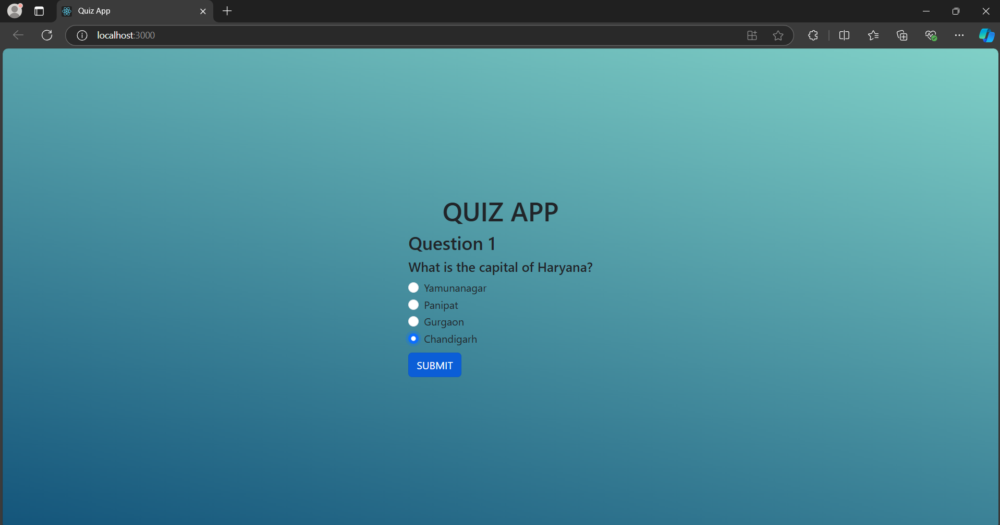
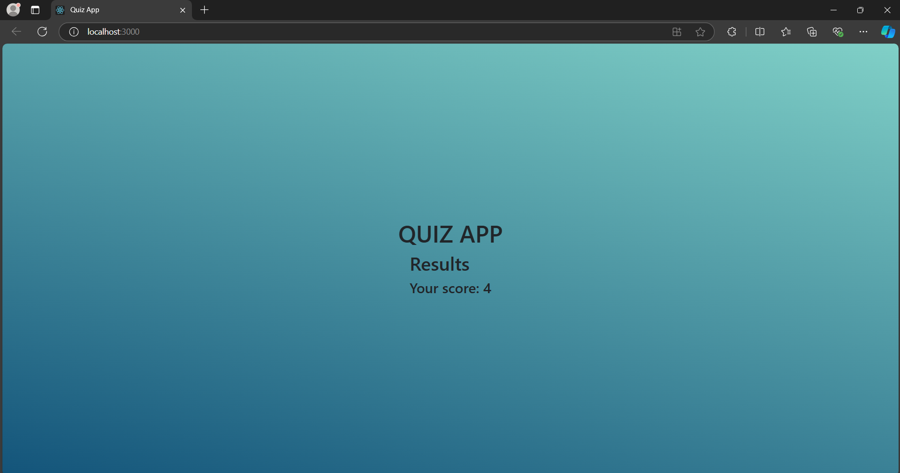

## Quiz-App
The Quiz App is a simple web application that allows users to take a quiz, answer multiple-choice questions, and view their results at the end.
## Features
  - Multiple-choice questions
  - Score calculation
## Technologies Used
  - React.js: Frontend JavaScript library for building user interfaces.
  - CSS: For styling the app.
  - JavaScript (ES6): Used to handle the quiz logic and state management.
  - HTML5: Basic structure of the web pages.
## Prerequisites
  - Node.js (which includes npm)
  - Basic understanding of React.js
## Screenshots
<div align="center">
     &nbsp;&nbsp; 
     
</div>

## Installation
### Clone the Project
``` bash
git clone https://github.com/sharlinaik/Quiz-App.git
cd Quiz-App
```


